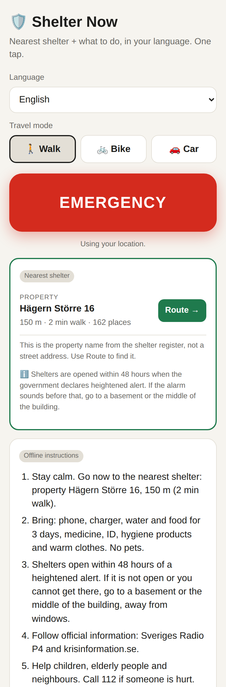
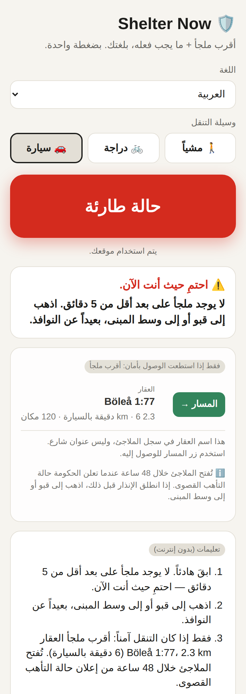
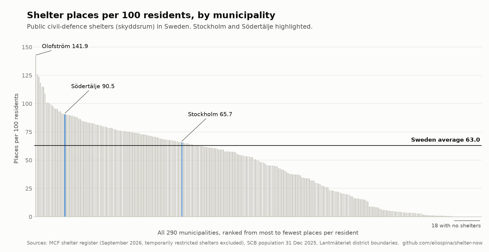

# 🛡️ Shelter Now

**Live app: [shelter-now-eta.vercel.app](https://shelter-now-eta.vercel.app)** · Built with Claude and Claude Code at Claude Build Day Stockholm, September 2026.

**One tap shows the nearest of Sweden's 62,761 public shelters, how to get
there, and what to do, in your language.**

Around 2 million people in Sweden were born abroad. Many have never heard the
word *skyddsrum* and don't know what the alarms mean. In a crisis, everyone
should know what to do, whatever language they speak.

<p align="center">
  
  &nbsp;&nbsp;
  
</p>

## What it does

- 🔴 **One EMERGENCY button** uses your location to find the 3 nearest shelters.
- 🚶🚲🚗 **Walking, cycling or driving:** travel time and a Google Maps route for each mode.
- ⚠️ **Take cover first when a shelter is too far.** If the nearest shelter is more than 5 minutes away (about 400 m on foot), the app tells you to go to a basement or the middle of the building, and shows the shelter only as a second option.
- 🧭 **Calm, numbered instructions** written by Claude in your language, limited to official MCF and Krisinformation guidance. If Claude can't answer, built-in instructions appear instead, so the button always works.
- 🌍 **7 languages:** Swedish, English, Spanish, Arabic, Persian, Ukrainian and Somali, with right-to-left layout for Arabic and Persian.
- 🔊 **The alarms explained:** *beredskapslarm* (go inside, listen to Sveriges Radio P4) and *flyglarm* (take cover immediately).
- 📦 **What to bring and what to leave:** water and food for 3 days, medicine, ID and more. Pets are not allowed in shelters.
- 💬 **"I'm safe" message** to family by SMS or WhatsApp, with a link to the route.
- ℹ️ **Honest about the data:** shelters open within 48 hours of heightened alert, and the register names each shelter by its property designation (for example "Hägern Större 16"), not a street address. The app says both.

## What the data shows

Sweden has **62,761 shelters with 6.7 million places**, about 63 for every
100 residents. I matched every shelter to its municipality and to SCB's 2025
population figures.



| Area | Shelters | Places | Population (2025) | Places per 100 residents |
|---|---:|---:|---:|---:|
| Stockholms kommun | 6,430 | 656,857 | 999,239 | 65.7 |
| Stockholms län | 13,817 | 1,604,876 | 2,486,251 | 64.6 |
| Södertälje kommun | 779 | 93,010 | 102,772 | 90.5 |
| Sverige | 62,761 | 6,678,979 | 10,605,529 | 63.0 |

- **Highest:** Olofström, with 141.9 places per 100 residents.
- **18 of 290 municipalities have no shelters at all**, among them Orust,
  Tanum, Vilhelmina and Bjurholm.
- **186 municipalities** are below the national average.

The full table for all 290 municipalities is in
[`data/shelters_by_municipality.csv`](data/shelters_by_municipality.csv).

## How Claude is used

- **In the app:** a server route asks Claude for 5 short, calm steps in the
  chosen language, adapted to the travel mode and to whether the shelter is
  near or far. The prompt contains only official facts from MCF and
  Krisinformation, and tells Claude not to add its own rules.
- **To build it:** the app, the translations, the data conversion and the
  municipality analysis were built in one day with Claude Code.

## Data and method

**Shelters.** Official data from **Myndigheten för civilt försvar**
(Skyddsrum), converted from the source shapefile (SWEREF 99 TM / EPSG:3006)
to WGS84 GeoJSON, keeping only `id`, `address`, `places`, `lat` and `lon`.
633 records marked `Tillfällig begränsning` (temporarily restricted) are left
out; `data/stats.json` has the full breakdown.

**Municipalities.** The shelter data has no municipality field, so
`scripts/shelters_by_municipality.py` places each shelter using
Lantmäteriet's detailed *distrikt* boundaries (from the open
[swemapdata](https://github.com/borstell/swemapdata) package, pinned to a
fixed commit and checksummed). Each distrikt is labelled with the
municipality it overlaps most, and a municipality belongs to the county
whose code it starts with. Only 37 of Stockholms kommun's shelters lie within
100 m of its border, so small boundary errors change its total by under 1%.

**Population.** SCB, *Folkmängden efter region, civilstånd, ålder och kön.
År 2025* (31 December 2025), stored as `TAB5557_sv.zip`.

To regenerate the data and the chart:

```bash
pip install -r scripts/requirements.txt
unzip Skyddsrum.zip -d data/raw/skyddsrum
python3 scripts/convert_shelters.py                 # data/shelters.geojson
python3 scripts/shelters_by_municipality.py         # data/shelters_by_municipality.csv
python3 scripts/plot_shelters_per_municipality.py   # docs/shelters-per-100-residents.png
```

The unzipped shapefile (`data/raw/`) is gitignored; only the processed data
is committed.

## Running locally

```bash
npm install
cp .env.example .env.local   # then add your ANTHROPIC_API_KEY
npm run dev
```

Open http://localhost:3000. Without `ANTHROPIC_API_KEY`, the app uses the
built-in instructions in the selected language. If location is unavailable,
it uses Stockholm Central Station as a demo location and says so.

## Code map

- `app/page.js`: the mobile-first interface.
- `app/api/shelters/nearest/route.js`: returns the 3 nearest shelters to a
  position, so the full dataset is never sent to the phone.
- `app/api/instructions/route.js`: asks Claude for the instructions and falls
  back to the built-in ones on any error.
- `lib/i18n.js`: every translated text, including the built-in instructions.
- `lib/geo.js`: distances, travel times, the 5-minute rule and route links.
- `lib/shelters.js`: loads the shelter data on the server.
- `lib/protect.js`: rate limits and cache for the Claude endpoint.

## Protecting the API key

`/api/instructions` is public, so it limits what a caller can make it do:

- The phone sends a shelter id and a distance, never free text. The server
  looks the shelter up in the dataset, so the endpoint can't be used as a
  general-purpose chatbot.
- Answers are cached for 6 hours per language, travel mode, shelter and
  distance, so repeat requests don't call Claude again.
- Claude calls are limited to 10 per minute per IP and 120 per minute per
  server instance. Over the limit, people still get the built-in instructions.
- Requests use low effort and at most 1,024 output tokens.

These limits live in memory, so they apply per server instance. For a hard
ceiling on cost, also set a monthly spend limit in the Anthropic Console.

## Deploying

The live app runs on Vercel, connected to this repository: every push to
`main` deploys to production. Set `ANTHROPIC_API_KEY` under the project's
**Settings → Environment Variables**.

## Disclaimer

Data: Myndigheten för civilt försvar. Shelter Now is an independent project,
not an official service. In a real emergency, follow krisinformation.se,
Sveriges Radio P4 and 112.
